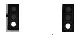
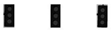
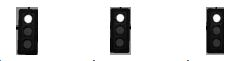
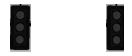

### Individual Submission
E-mail: ahmed.bakr@feng.bu.edu.eg

This is the project repo for the final project of the Udacity Self-Driving Car Nanodegree: Programming a Real Self-Driving Car. For more information about the project, see the project introduction [here](https://classroom.udacity.com/nanodegrees/nd013/parts/6047fe34-d93c-4f50-8336-b70ef10cb4b2/modules/e1a23b06-329a-4684-a717-ad476f0d8dff/lessons/462c933d-9f24-42d3-8bdc-a08a5fc866e4/concepts/5ab4b122-83e6-436d-850f-9f4d26627fd9).


The project is built using ROS nodes that communicate with each other using ros-topics as shown in the following figure:


### Project requirements
This projects requires the car to move in the middle lane and stop at the red lights using detection and classification mechanisms.
The acceleration of the car should not exceed 10 m/s^2, and the jerk should not exceed 10 m/s^2.

Lets talk briefly about the important parts of the project:

#### Waypoint Updater
This ros node is responsible for giving the simulator a list of points (Trajectory) for the next T seconds so that the car follows.
I used 50 lookahead points.
This node is responsible for the acceleration and the deceleration of the car.
It accelerates as long as there is no red traffic in front of it, and decelerates otherwise.

#### Waypoint Loader
This ros node runs only once and it is responsible for genrating the way points for the whole road.
I used it also to set the maximum speed of the car.

#### DBW node
Drive by wire node is responsible for giving commands to the car so that it makes sure that the car follows the trajectory.
Those commads are:
 - Road Wheel angle
 - Acceleration (Throttle)
 - Deceleration (Brake)
 It publishes new commands in 50HZ
 
#### Twist constroller
A PID controller that controls the throttle of the car. I used the P,I, and D configurations used in the PID project which are:
- P ==> 0.3
- I ==> 0.001
- D ==> 10

I also set the maximum acceleration of the car to be 0.2.
The car fully stops if we apply a force of 700 N*m

#### Traffic light detector
The most difficult problem in this project is to detect the traffic signs.
I used the [tensorflow detection API](https://github.com/ahmedmbakr/CarND-Capstone/tree/master/ros/src/tl_detector/object_detection). I followed the installation steps to download the model and its dependencies.
I used ssd-mobilenet-coco-v1.
The model can be found in the following directory from the git repo `CarND-Capstone/ros/src/tl_detector/object_detection/`.
The main script for running the detection model is `object_detection_main.py`.
The most important function in this python file is `detect_objects_in_img` which takes an image, and returns a list of the object detected in the image, and their exact locations in the image with their classes.
We are interested in class-id 10 which is the traffic sign class.

#### Traffic sign classification
Once the traffic signs are detected, I cut the detected objects into small images, and using computer-vision I use the threshold values to get the red, and green pixels in the traffic so that I can know if it is red or green sign.
I can classify the images with a very high acuracy.
I have only problems in the speed of the detector because I am running the tensorflow on the CPU not GPU.

The following image shows the green component of a green traffic sign.


The following image shows the red component of a green traffic sign.


The following image shows the red component of a red traffic sign.


The following image shows the green component of a red traffic sign.


Please use **one** of the two installation options, either native **or** docker installation.

### Native Installation

* Be sure that your workstation is running Ubuntu 16.04 Xenial Xerus or Ubuntu 14.04 Trusty Tahir. [Ubuntu downloads can be found here](https://www.ubuntu.com/download/desktop).
* If using a Virtual Machine to install Ubuntu, use the following configuration as minimum:
  * 2 CPU
  * 2 GB system memory
  * 25 GB of free hard drive space

  The Udacity provided virtual machine has ROS and Dataspeed DBW already installed, so you can skip the next two steps if you are using this.

* Follow these instructions to install ROS
  * [ROS Kinetic](http://wiki.ros.org/kinetic/Installation/Ubuntu) if you have Ubuntu 16.04.
  * [ROS Indigo](http://wiki.ros.org/indigo/Installation/Ubuntu) if you have Ubuntu 14.04.
* [Dataspeed DBW](https://bitbucket.org/DataspeedInc/dbw_mkz_ros)
  * Use this option to install the SDK on a workstation that already has ROS installed: [One Line SDK Install (binary)](https://bitbucket.org/DataspeedInc/dbw_mkz_ros/src/81e63fcc335d7b64139d7482017d6a97b405e250/ROS_SETUP.md?fileviewer=file-view-default)
* Download the [Udacity Simulator](https://github.com/udacity/CarND-Capstone/releases).

### Docker Installation
[Install Docker](https://docs.docker.com/engine/installation/)

Build the docker container
```bash
docker build . -t capstone
```

Run the docker file
```bash
docker run -p 4567:4567 -v $PWD:/capstone -v /tmp/log:/root/.ros/ --rm -it capstone
```

### Port Forwarding
To set up port forwarding, please refer to the [instructions from term 2](https://classroom.udacity.com/nanodegrees/nd013/parts/40f38239-66b6-46ec-ae68-03afd8a601c8/modules/0949fca6-b379-42af-a919-ee50aa304e6a/lessons/f758c44c-5e40-4e01-93b5-1a82aa4e044f/concepts/16cf4a78-4fc7-49e1-8621-3450ca938b77)

### Usage

1. Clone the project repository
```bash
git clone https://github.com/ahmedmbakr/CarND-Capstone.git
```

2. Install python dependencies
```bash
cd CarND-Capstone
pip install -r requirements.txt
```
3. Make and run styx
```bash
cd ros
catkin_make
source devel/setup.sh
roslaunch launch/styx.launch
```
4. Run the simulator

### Real world testing
1. Download [training bag](https://s3-us-west-1.amazonaws.com/udacity-selfdrivingcar/traffic_light_bag_file.zip) that was recorded on the Udacity self-driving car.
2. Unzip the file
```bash
unzip traffic_light_bag_file.zip
```
3. Play the bag file
```bash
rosbag play -l traffic_light_bag_file/traffic_light_training.bag
```
4. Launch your project in site mode
```bash
cd CarND-Capstone/ros
roslaunch launch/site.launch
```
5. Confirm that traffic light detection works on real life images
